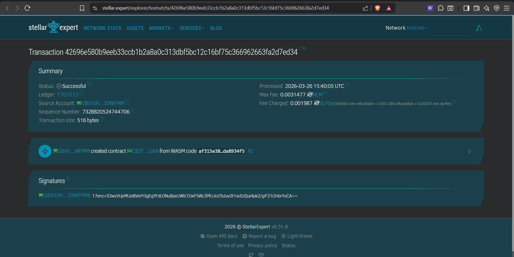

# 🛡️ MicroInsurancePool

**MicroInsurancePool** - Decentralized Community-Governed Insurance on Stellar Blockchain


---

## Project Description

MicroInsurancePool is a fully decentralized insurance protocol built on the Stellar blockchain using the Soroban Smart Contract SDK. It enables communities to create self-governed insurance pools where members collectively pay premiums, file claims, and vote on each other's payouts — without any company, broker, or middleman involved.

The protocol leverages the Stellar Asset Contract (SAC) standard to ensure that every premium payment and claim payout involves real, verifiable token transfers on-chain. Governance is enforced entirely by smart contract logic: voting deadlines are anchored to the ledger timestamp, quorum requirements prevent manipulation by low participation, and built-in conflict-of-interest guards stop claimants from influencing their own outcomes.

By combining blockchain immutability with community governance, MicroInsurancePool brings transparent, trustless, and accessible insurance to anyone with a Stellar wallet.

---

## Project Vision

Our vision is to democratize financial protection by removing institutional barriers from insurance:

- **Eliminating Middlemen**: Traditional insurance relies on opaque companies with high overhead costs. MicroInsurancePool puts governance directly in the hands of members, reducing premiums and increasing trust.
- **Enabling Financial Inclusion**: Low-cost micro-premiums on Stellar make insurance accessible to underserved communities that lack access to traditional financial services.
- **Guaranteeing Transparency**: Every claim, every vote, and every payout is recorded immutably on the Stellar blockchain — fully auditable by anyone at any time.
- **Enforcing Fairness by Code**: Smart contract rules — quorum, deadlines, self-vote prevention — ensure that no single member can game the system, regardless of their influence or wealth.
- **Building Trustless Cooperation**: Members don't need to trust each other personally. They trust the code. The contract enforces the rules impartially and automatically.

We envision a future where communities worldwide can form their own insurance pools in minutes, protecting each other against medical emergencies, natural disasters, property damage, and beyond.

---

## Key Features

### 1. **Real Token Transfers via Stellar Asset Contract (SAC)**

- Premium payments are transferred from member's wallet directly to the contract using SAC
- Approved claim payouts are sent automatically from the contract to the claimant's wallet
- Compatible with native XLM and any Stellar-issued asset (USDC, EURC, etc.)
- No manual intervention required — the contract handles all fund movements

### 2. **Community-Governed Claim Voting**

- Every claim is put to a vote among all pool members
- Members cast approve or reject votes within the allowed time window
- Majority vote (>50%) determines the outcome with no administrator override
- Transparent vote counts stored on-chain and readable by anyone

### 3. **Time-Bound Voting with Ledger Timestamps**

- Each claim is assigned a voting deadline computed from `env.ledger().timestamp()`
- No votes are accepted after the deadline — enforced at the contract level
- Claims cannot be executed while voting is still active
- Voting period duration is configurable at contract initialization

### 4. **Quorum & Conflict-of-Interest Protection**

- A minimum of 50% of eligible pool members must vote before a claim can be executed
- Claimants are automatically blocked from voting on their own claim (self-vote prevention)
- These rules are hardcoded into the contract and cannot be bypassed by anyone, including the admin

### 5. **On-Chain Reputation System**

- Every member starts with a reputation score of 100 points
- Approved claims reward the claimant with +5 reputation points
- Rejected claims penalize the claimant with −10 reputation points
- Reputation is stored persistently on-chain and queryable at any time

### 6. **Gas-Optimized Storage Architecture**

- All data stored using Soroban `persistent()` storage for maximum data longevity
- TTL (Time-to-Live) extensions applied on every write to prevent data expiry
- DataKey caching pattern eliminates redundant `clone()` operations per function call
- Pool balance read once per transaction and reused across conditional branches

---

## Contract Details

- **Contract Address (Testnet):** `CBZF...` *(click the contract on Stellar Expert to get the full address)*
- **Deploy Transaction:** [`42696e58...fa2d7ed34`](https://stellar.expert/explorer/testnet/tx/42696e580b9eeb33ccb1b2a8a0c313dbf5bc12c16bf75c366962663fa2d7ed34)
- **Ledger:** `1707513` · **Processed:** `2026-03-26 15:40:05 UTC`
- **Network:** Stellar Testnet
- **SDK Version:** Soroban SDK v25
- **RPC Endpoint:** `https://soroban-testnet.stellar.org:443`



> 🔍 Verify on [Stellar Expert Testnet](https://stellar.expert/explorer/testnet/tx/42696e580b9eeb33ccb1b2a8a0c313dbf5bc12c16bf75c366962663fa2d7ed34)

---

## Future Scope

### Short-Term Enhancements

1. **Staking-Based Governance Weight**: Allow members who stake more tokens to have proportionally greater voting weight, incentivizing higher premiums
2. **Partial Payouts**: Support for partial claim approvals where the community votes on a payout percentage rather than a binary approve/reject
3. **Appeal Mechanism**: Allow claimants to appeal rejected claims within a secondary review period with a higher quorum requirement
4. **Claim Category Tags**: Add structured categories (medical, property, casualty) to claims for easier filtering and analytics

### Medium-Term Development

5. **Multi-Pool Architecture**: Support multiple isolated insurance pools with different token types, premium structures, and governance rules
   - Each pool configured independently at initialization
   - Cross-pool reputation portability
   - Pool-specific voting periods and quorum thresholds
6. **Automated Premium Collection**: Recurring premium contributions enforced via time-based ledger triggers
7. **Risk Scoring Engine**: On-chain algorithm that adjusts premiums dynamically based on member reputation and claim history
8. **Inter-Contract Integration**: Allow external Soroban contracts to query pool membership and reputation scores

### Long-Term Vision

9. **DAO Governance Upgrade**: Transition contract parameters (quorum, voting period, reputation weights) to a fully decentralized DAO vote
10. **Cross-Chain Bridges**: Expand pool participation to members on other blockchains via cross-chain messaging protocols
11. **Decentralized Frontend Hosting**: Deploy the web interface to IPFS or Arweave for a fully decentralized user experience
12. **Privacy-Preserving Votes**: Implement zero-knowledge proof voting so vote choices are hidden until the deadline expires, preventing herd behavior
13. **AI-Assisted Fraud Detection**: Off-chain oracle integration that flags statistically anomalous claims for higher community scrutiny
14. **Decentralized Identity (DID) Integration**: Bind pool membership to verifiable credentials to prevent Sybil attacks

### Enterprise & Social Impact

15. **Parametric Insurance Triggers**: Automate claim approval based on oracle data (e.g., weather data for crop insurance)
16. **NGO & Microfinance Partnerships**: White-label pool deployment for humanitarian organizations and microfinance institutions
17. **Regulatory Compliance Module**: Optional KYC/AML layer via privacy-respecting on-chain identity attestation
18. **Multi-Language Frontend**: Localize the interface for communities in Southeast Asia, Africa, and Latin America

---

## Technical Requirements

- Rust programming language (latest stable)
- Soroban SDK v25
- Stellar CLI (`stellar-cli`)
- `wasm32-unknown-unknown` compilation target
- Stellar Testnet RPC access

## Getting Started

```bash
# Install Rust
curl --proto '=https' --tlsv1.2 -sSf https://sh.rustup.rs | sh
rustup target add wasm32-unknown-unknown

# Install Stellar CLI
cargo install --locked stellar-cli --features opt

# Run tests
cargo test -p micro-insurance-pool

# Build WASM
cargo build --target wasm32-unknown-unknown --release -p micro-insurance-pool
```

Deploy the smart contract to Stellar's Soroban network and interact with it using the five main functions:

- `initialize()` — One-time setup: configure token and voting rules
- `join_pool()` — Join as a member and pay your premium
- `file_claim()` — Submit a claim for community review
- `vote_claim()` — Vote to approve or reject a pending claim
- `execute_claim()` — Finalize a claim after the voting window closes

For the full deploy guide, see [`contracts/micro_insurance_pool/README.md`](./contracts/micro_insurance_pool/README.md).

---

**MicroInsurancePool** — Trustless Insurance, Powered by Community 🛡️
